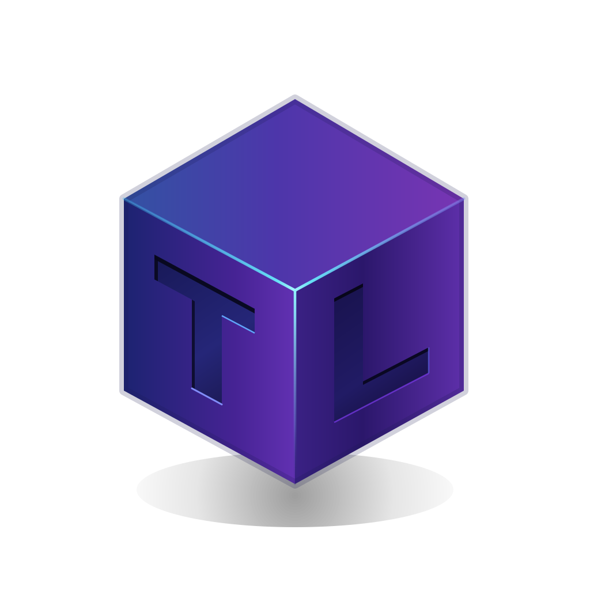
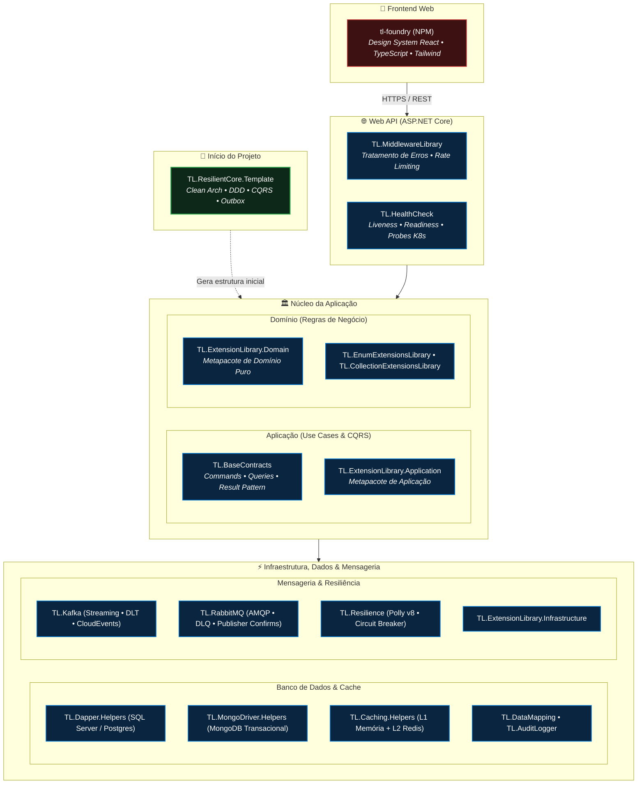

 <div align="center">


  # 👋 Thaylon Lopes
  ### **Engenheiro de Software | Arquiteto de Software Distribuído**

  <p align="center">
    <a href="https://github.com/thaylonlopes">
      
    </a>
    <!-- METRICS:NUGET_PACKAGES -->
    <a href="https://www.nuget.org/profiles/ThaylonMALopes">
      
    </a>
    <!-- /METRICS:NUGET_PACKAGES -->
    <a href="https://www.npmjs.com/package/tl-foundry">
      
    </a>
    <!-- METRICS:TOTAL_DOWNLOADS -->
    <a href="https://www.nuget.org/profiles/ThaylonMALopes">
      
    </a>
    <!-- /METRICS:TOTAL_DOWNLOADS -->
    <a href="https://www.linkedin.com/in/thaylon-lopes/">
      
    </a>
  </p>

  <p align="center">
    Engenheiro de Software com pós-graduação em <strong>Arquitetura de Software Distribuído</strong> e trajetória de quase 10 anos projetando e sustentando soluções resilientes de missão crítica com C#, ecossistema .NET, mensageria e alta volumetria em grandes corporações do mercado financeiro e industrial:<br/>
    <strong>XP Investimentos</strong> • <strong>BTG Pactual</strong> • <strong>Pottencial Seguradora</strong> • <strong>Aperam South America</strong>
  </p>

</div>
<br clear="right" />

---

## 🚀 Acelerador de Arquitetura (.NET Starter Kit)

Template oficial para inicialização de microsserviços e Web APIs em .NET 9 estruturados com Clean Architecture, DDD, CQRS (MediatR), Transactional Outbox Pattern, Testcontainers e testes de carga k6.

| Template | Descrição | Runtime | Versão | Downloads | Documentação |
| :--- | :--- | :---: | :---: | :---: | :---: |
| **[`TL.ResilientCore.Template`](https://github.com/thaylonlopes/TL.ResilientCore)** | Starter kit corporativo: Clean Architecture, CQRS, Outbox com RabbitMQ/Kafka, Testcontainers e k6 | `net9.0` | [](https://www.nuget.org/packages/TL.ResilientCore.Template) | [](https://www.nuget.org/packages/TL.ResilientCore.Template) | [📘 README](https://github.com/thaylonlopes/TL.ResilientCore#readme) • [🏛️ Arquitetura](https://github.com/thaylonlopes/TL.ResilientCore/blob/main/TL.ResilientCore/docs/arquitetura/visao-geral.md) |

```bash
# 1. Instalar o template oficial
dotnet new install TL.ResilientCore.Template

# 2. Criar nova solução estruturada
dotnet new tl-resilientcore -n MeuProjetoCorporativo
```

---

## 🗺️ Mapa de Arquitetura do Ecossistema

Visão de como as soluções se conectam em cada camada:



---

## 📦 Metapacotes Clean Architecture (`TL.ExtensionLibrary`)

Conjuntos modulares organizados por camada para evitar acoplamento indevido e garantir isolamento de dependências.

```
TL.ExtensionLibrary.Infrastructure (Queryable, HttpClient, Assembly)
    └── TL.ExtensionLibrary.Application (Object, ClaimsPrincipal)
            └── TL.ExtensionLibrary.Domain (String, Numeric, DateTime, Enum, Collection)
```

| Metapacote | Camada / Escopo | O que inclui | Runtimes | Versão | Downloads | Arquitetura |
| :--- | :--- | :--- | :---: | :---: | :---: | :---: |
| **[`TL.ExtensionLibrary.Domain`](https://github.com/thaylonlopes/ExtensionLibrary)** | **Domínio Puro** | Extensões fundamentais sem dependências de infra, web ou banco (`String`, `Numeric`, `DateTime`, `Enum`, `Collection`) | `net8.0`<br/>`netstandard2.0` | [](https://www.nuget.org/packages/TL.ExtensionLibrary.Domain) | [](https://www.nuget.org/packages/TL.ExtensionLibrary.Domain) | [🏛️ Arquitetura](https://github.com/thaylonlopes/ExtensionLibrary/tree/master/docs/arquitetura) |
| **[`TL.ExtensionLibrary.Application`](https://github.com/thaylonlopes/ExtensionLibrary)** | **Aplicação** | Manipulação de DTOs, segurança e identidade (`Object`, `ClaimsPrincipal`) + inclui transitivamente o pacote `Domain` | `net8.0`<br/>`netstandard2.0` | [](https://www.nuget.org/packages/TL.ExtensionLibrary.Application) | [](https://www.nuget.org/packages/TL.ExtensionLibrary.Application) | [🏛️ Arquitetura](https://github.com/thaylonlopes/ExtensionLibrary/tree/master/docs/arquitetura) |
| **[`TL.ExtensionLibrary.Infrastructure`](https://github.com/thaylonlopes/ExtensionLibrary)** | **Infraestrutura** | Consultas dinâmicas, HTTP resiliente e scanning de assemblies (`Queryable`, `HttpClient`, `Assembly`) + inclui `Application` e `Domain` | `net8.0`<br/>`netstandard2.0` | [](https://www.nuget.org/packages/TL.ExtensionLibrary.Infrastructure) | [](https://www.nuget.org/packages/TL.ExtensionLibrary.Infrastructure) | [🏛️ Arquitetura](https://github.com/thaylonlopes/ExtensionLibrary/tree/master/docs/arquitetura) |

---

## 🏛️ Catálogo de Módulos (.NET / NuGet)

Bibliotecas especializadas para mensageria, resiliência, dados e fundação de contratos.

| Pacote | Finalidade | Runtimes | Versão | Downloads | Documentação |
| :--- | :--- | :---: | :---: | :---: | :---: |
| **[`TL.BaseContracts`](https://github.com/thaylonlopes/BuildingBlocks)** | Contratos base em C# puro: Commands, Queries, Events, Result Pattern, Errors e RFC 7807 | `net8.0`<br/>`net9.0`<br/>`netstandard2.0` | [](https://www.nuget.org/packages/TL.BaseContracts) | [](https://www.nuget.org/packages/TL.BaseContracts) | [📘 README](https://github.com/thaylonlopes/BuildingBlocks#readme) • [🏛️ ADR-001](https://github.com/thaylonlopes/BuildingBlocks/blob/main/docs/adr/ADR-001-tl-basecontracts.md) |
| **[`TL.Resilience`](https://github.com/thaylonlopes/BuildingBlocks)** | Políticas com Polly v8: Retry com Jitter decorrelacionado, Circuit Breaker e Timeout | `net8.0`<br/>`net9.0` | [](https://www.nuget.org/packages/TL.Resilience) | [](https://www.nuget.org/packages/TL.Resilience) | [📘 README](https://github.com/thaylonlopes/BuildingBlocks#readme) • [🏛️ ADR-007](https://github.com/thaylonlopes/BuildingBlocks/blob/main/docs/adr/ADR-007-tl-resilience.md) |
| **[`TL.MiddlewareLibrary`](https://github.com/thaylonlopes/TL.MiddlewareLibrary)** | Middlewares para tratamento global de exceções, Correlation ID e Rate Limiting por IP | `net8.0`<br/>`net9.0` | [](https://www.nuget.org/packages/TL.MiddlewareLibrary) | [](https://www.nuget.org/packages/TL.MiddlewareLibrary) | [📘 README](https://github.com/thaylonlopes/TL.MiddlewareLibrary#readme) • [🏛️ ADR-001](https://github.com/thaylonlopes/TL.MiddlewareLibrary/blob/main/docs/adr/ADR-001-arquitetura-e-convencoes.md) |
| **[`TL.HealthCheck`](https://github.com/thaylonlopes/BuildingBlocks)** | Health Checks padronizados (Liveness, Readiness, UI Client) para ASP.NET Core e Kubernetes | `net8.0`<br/>`net9.0` | [](https://www.nuget.org/packages/TL.HealthCheck) | [](https://www.nuget.org/packages/TL.HealthCheck) | [📘 README](https://github.com/thaylonlopes/BuildingBlocks#readme) • [🏛️ ADR-002](https://github.com/thaylonlopes/BuildingBlocks/blob/main/docs/adr/ADR-002-tl-healthcheck.md) |
| **[`TL.RabbitMQ`](https://github.com/thaylonlopes/Messaging)** | AMQP com Publisher Confirms, Dead-Letter Queue (.dlq) automática e desserialização via `Span<T>` | `net8.0`<br/>`net9.0` | [](https://www.nuget.org/packages/TL.RabbitMQ) | [](https://www.nuget.org/packages/TL.RabbitMQ) | [📘 README](https://github.com/thaylonlopes/Messaging#readme) • [🏛️ ADR-001](https://github.com/thaylonlopes/Messaging/blob/main/docs/adr/ADR-001-tl-rabbitmq.md) |
| **[`TL.Kafka`](https://github.com/thaylonlopes/Messaging)** | Apache Kafka com Polly v8, Dead Letter Topic (.dlt), CloudEvents e headers estruturados | `net8.0`<br/>`net9.0` | [](https://www.nuget.org/packages/TL.Kafka) | [](https://www.nuget.org/packages/TL.Kafka) | [📘 README](https://github.com/thaylonlopes/Messaging#readme) • [🏛️ ADR-002](https://github.com/thaylonlopes/Messaging/blob/main/docs/adr/ADR-002-tl-kafka.md) |
| **[`TL.Dapper.Helpers`](https://github.com/thaylonlopes/DataHelpers)** | Repositórios SQL com Dapper, paginação dinâmica por cursor e consultas otimizadas | `net8.0`<br/>`net9.0` | [](https://www.nuget.org/packages/TL.Dapper.Helpers) | [](https://www.nuget.org/packages/TL.Dapper.Helpers) | [📘 README](https://github.com/thaylonlopes/DataHelpers#readme) • [🏛️ ADR-004](https://github.com/thaylonlopes/DataHelpers/blob/main/docs/adr/ADR-004-pacote-dapper-helpers.md) |
| **[`TL.MongoDriver.Helpers`](https://github.com/thaylonlopes/DataHelpers)** | Repositórios MongoDB com suporte a transações atômicas via MongoContext | `net8.0`<br/>`net9.0` | [](https://www.nuget.org/packages/TL.MongoDriver.Helpers) | [](https://www.nuget.org/packages/TL.MongoDriver.Helpers) | [📘 README](https://github.com/thaylonlopes/DataHelpers#readme) • [🏛️ ADR-008](https://github.com/thaylonlopes/DataHelpers/blob/main/docs/adr/ADR-008-pacote-mongodriver-helpers.md) |
| **[`TL.Caching.Helpers`](https://github.com/thaylonlopes/DataHelpers)** | Cache multinível híbrido (L1 memória + L2 Redis) com resiliência e locking distribuído | `net8.0`<br/>`net9.0` | [](https://www.nuget.org/packages/TL.Caching.Helpers) | [](https://www.nuget.org/packages/TL.Caching.Helpers) | [📘 README](https://github.com/thaylonlopes/DataHelpers#readme) • [🏛️ ADR-002](https://github.com/thaylonlopes/DataHelpers/blob/main/docs/adr/ADR-002-pacote-caching-helpers.md) |
| **[`TL.DataMapping`](https://github.com/thaylonlopes/DataHelpers)** | Mapeamento de propriedades compilado via Expression Trees com Bounded LRU Cache thread-safe | `net8.0`<br/>`net9.0` | [](https://www.nuget.org/packages/TL.DataMapping) | [](https://www.nuget.org/packages/TL.DataMapping) | [📘 README](https://github.com/thaylonlopes/DataHelpers#readme) • [🏛️ ADR-001](https://github.com/thaylonlopes/DataHelpers/blob/main/docs/adr/ADR-001-pacote-datamapping.md) |
| **[`TL.AuditLogger`](https://github.com/thaylonlopes/DataHelpers)** | Trilha de auditoria CRUD estruturada com mascaramento de dados sensíveis e sanitização | `net8.0`<br/>`net9.0` | [](https://www.nuget.org/packages/TL.AuditLogger) | [](https://www.nuget.org/packages/TL.AuditLogger) | [📘 README](https://github.com/thaylonlopes/DataHelpers#readme) • [🏛️ ADR-003](https://github.com/thaylonlopes/DataHelpers/blob/main/docs/adr/ADR-003-pacote-auditlogger.md) |
| **[`TL.EnumExtensionsLibrary`](https://github.com/thaylonlopes/ExtensionLibrary)** | Utilitários para Enums com cache thread-safe e resolução rápida de descrições | `net8.0`<br/>`netstandard2.0` | [](https://www.nuget.org/packages/TL.EnumExtensionsLibrary) | [](https://www.nuget.org/packages/TL.EnumExtensionsLibrary) | [📘 README](https://github.com/thaylonlopes/ExtensionLibrary#readme) • [🏛️ ADR-003](https://github.com/thaylonlopes/ExtensionLibrary/blob/master/docs/adr/ADR-003-enum-extensions-library.md) |
| **[`TL.CollectionExtensionsLibrary`](https://github.com/thaylonlopes/ExtensionLibrary)** | Paginação em memória por keyset, batching (`ChunkBy`) e fatiamento sem alocações desnecessárias | `net8.0`<br/>`netstandard2.0` | [](https://www.nuget.org/packages/TL.CollectionExtensionsLibrary) | [](https://www.nuget.org/packages/TL.CollectionExtensionsLibrary) | [📘 README](https://github.com/thaylonlopes/ExtensionLibrary#readme) • [🏛️ ADR-007](https://github.com/thaylonlopes/ExtensionLibrary/blob/master/docs/adr/ADR-007-collection-extensions-library.md) |

---

### 🎨 Frontend Corporativo (NPM / React)

| Pacote | Finalidade | Stack | Versão | Downloads | Links |
| :--- | :--- | :---: | :---: | :---: | :---: |
| **[`tl-foundry`](https://www.npmjs.com/package/tl-foundry)** | Design System corporativo com tabelas virtualizadas (`DataTable`, `TreeTable`), formulários dinâmicos e acessibilidade WCAG | `React 18/19`<br/>`TypeScript`<br/>`Tailwind CSS` | [](https://www.npmjs.com/package/tl-foundry) | [](https://www.npmjs.com/package/tl-foundry) | [📘 NPM Package](https://www.npmjs.com/package/tl-foundry)<br/>[🎨 Storybook](https://main--6a79b8b686500cbc56063fb1.chromatic.com/) |

---

## 🛠️ Stack Tecnológica

<div align="center">

| Área | Tecnologias & Ferramentas |
| :--- | :--- |
| **Back-end & Linguagens** | `C#` • `.NET 8` • `.NET 9` • `ASP.NET Core` • `Entity Framework Core` • `Dapper` • `MediatR` |
| **Mensageria & Streaming** | `Apache Kafka` • `RabbitMQ` • `CloudEvents` • `Transactional Outbox` |
| **Bancos de Dados & Cache** | `SQL Server` • `PostgreSQL` • `Oracle` • `MongoDB` • `Redis` *(Cache L1/L2)* |
| **Front-end & UI** | `React 18/19` • `TypeScript` • `Tailwind CSS` • `Storybook` • `Chromatic` |
| **Arquitetura & Design** | `Domain-Driven Design (DDD)` • `CQRS` • `Clean Architecture` • `Event-Driven Architecture` • `RFC 7807` |
| **Testes & DevOps** | `GitHub Actions` • `Azure DevOps` • `Docker` • `Testcontainers` • `k6` • `xUnit` • `SonarQube` |

</div>

---

<div align="center">
  <sub>Telemetria de downloads sincronizada via GitHub Actions. Última atualização: <!-- METRICS:UPDATED_AT -->26/09/2026<!-- /METRICS:UPDATED_AT -->.</sub>
</div>
